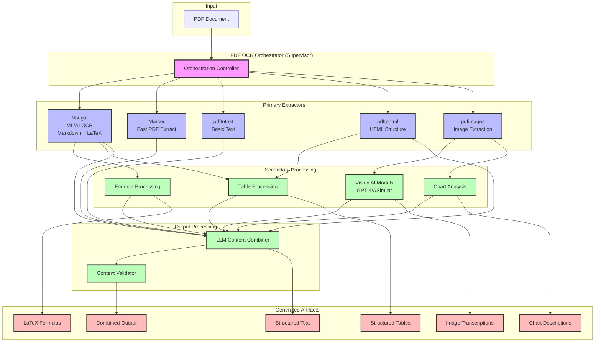

# ai ocr wrappers

## Long term vision.

`pdf_ocr_orchestrator` wrapper,
that will orchestrate whole pipeline
that uses variety of orchestrators and analyzers
in different ways and stages.

## Short term goal

Let's start by integrating: `nougat`, `marker`, and `pdftotext` and `pdftohtml`
tools and some LLM script combining outputs into one for better quality.

## Mid Term Goal

Utilized `pdftoimages in pipeline, combined with some vision models APIs
(like GPT-4V or similar)
for extracting information from images into text.

Utilize models finetuned (or finetune on our own) that will correct
broken OCR, like this model is finetuned for correcting OCR:
<https://replicate.com/pbevan1/llama-3.1-8b-ocr-correction>

## Moonshot vision

* Growing experience in PDF processing and collecting datasets
* May allow to create benchmarking suites for different extractors/OCRs/modesl
* inspired by how aider is benchmarking different models, parameters, and Flags.

## PDF OCR data Extraction Intro.

PDF OCR is more complex then it looks like.

PDFs contain:
* tables
* formulas
* images
* charts

Understanding all of this and properly transcribing may require
big chunk of tooling.

Also different OCR analyzers or PDF extractors
may have different strenghts and weaknesses.

And later images/charts can be analyzed/transcribed
or textualised (e.g. using LaTeX, Marmaid, etc)
in many ways.

Therefore, let's keep

## Extractor Modules:

* `pdfextractors/` directory with pdf OCR extractors
* `imgextractors/` directory with image OCR extracors
  * code sample `misc/code_samples/process_pdf_pages_one_by_one_as_image_example.py` can help in making code that will process pdf by extracting and processing page by page 

Supported by orchestrator:

* None yet

Implemented extractors:

* [x] nougat - ML/AI OCR extractor specialised in Markdown+LaTeX formulas/tables
    * `cudanexus/nougat` via replicate.com
* [x] marker - specialised for FAST extraction of simpler PDF documents
    * `cuuupid/marker` via replicate.com
* [x] cudanexus_ocr-surya - image OCR extractor
    * `cudanexus/ocr-surya` via replicate.com
* [x] deepseek-ocr - Advanced OCR with 97% accuracy at 9-10× context compression
    * `lucataco/deepseek-ocr` via replicate.com
    * `deepseek-ai/DeepSeek-OCR` via deepinfra.com

To be implemented:

* [ ] `markditdown` - MS tool for making data "LLM friendly" <https://github.com/microsoft/markitdown>
* [ ] `pdfimages` - images extractor
* [ ] `pdftotext` - basic text extraction
* [ ] `pdftohtml` - HTML structure extraction
* [ ] `abiruyt/text-extract-ocr` - text extraction from images
* [ ] `vwtyler/ocr-pdf` - simple PDF to text using Tesseract
* [ ] Anthropic Text and Visual PDF : <https://docs.anthropic.com/en/docs/build-with-claude/pdf-support>
* [ ] `jina.ai/reader` - has PDF support <https://jina.ai/reader/>
* [ ] Multimodal PDF Data Extraction by NVidia - <https://build.nvidia.com/nvidia/multimodal-pdf-data-extraction-for-enterprise-rag>

## Integration with imgextractors

We now support using `imgextractors` with PDFs by processing each page as an image. This is based on the example provided in `misc/code_samples/process_pdf_pages_one_by_one_as_image_example.py`.


## Diagram

Sonet 3.5. Claude.ai inspiration diagram when provided:
`misc/context_data/diagram.md` and `README.md` as concatenated input:

Diagram IS NOT TECHNICALLY CORRECT,
but is artistic inspiration by AI
about long term vision ;).




## TESTING

To test extractors, by making REST calls to production services (may incurr costs),
run:

```
./tests/integration_on_production/run_scripts_against_replicate.sh --with-rest
```
